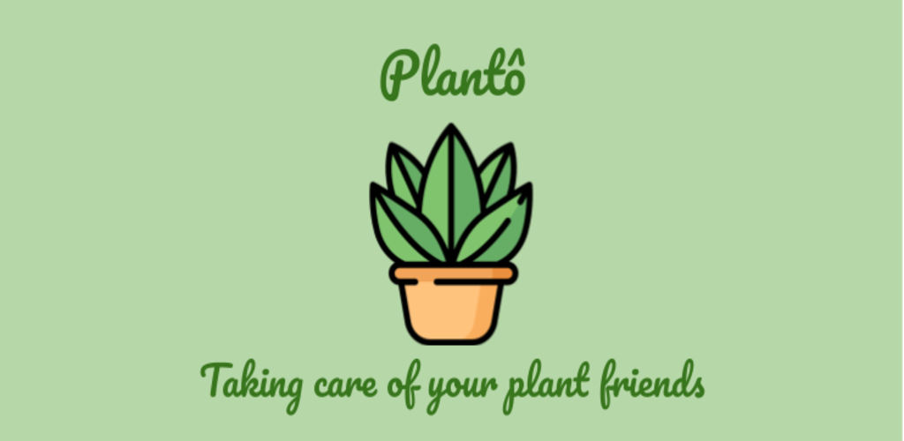
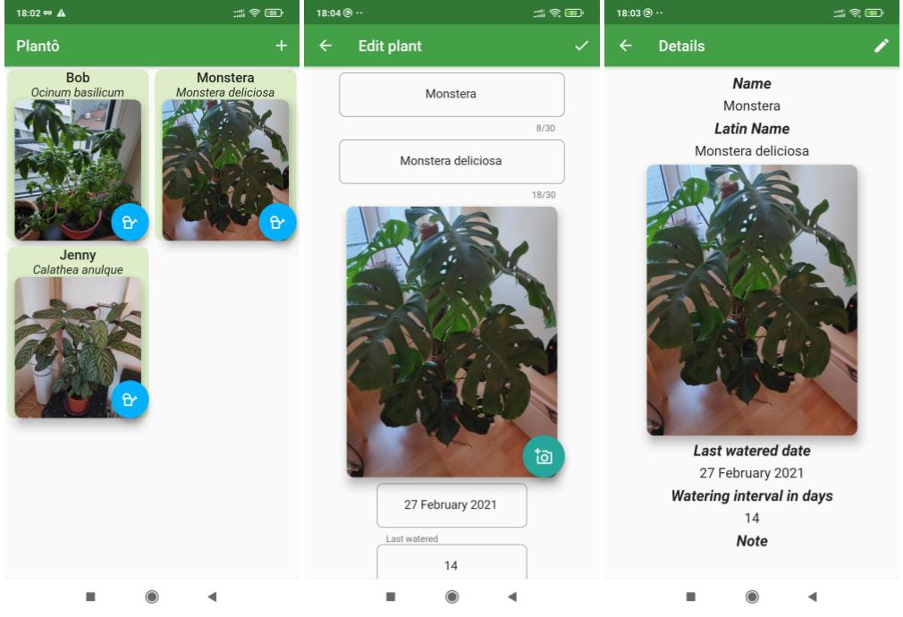

 

# planto - Take care of your plants easily

**Plantô** (_plante-eau_ in French) is a cross-platform application coded thanks to the Google [Flutter](https://flutter.dev/) framework.

## Contributing

The top level directory structure follows the standard Flutter project directory structure.

We try to adhere as much as possible to the [GitFlow branching model](https://www.atlassian.com/git/tutorials/comparing-workflows/gitflow-workflow).

**Please file an issue for whatever question or issue you have.**

When bumping the version, follow the procedure at [docs/versioning-howto.md](./docs/versioning-howto.md).

Icons made by <a href="https://www.freepik.com" title="Freepik">Freepik</a> from <a href="https://www.flaticon.com/" title="Flaticon">www.flaticon.com</a>

